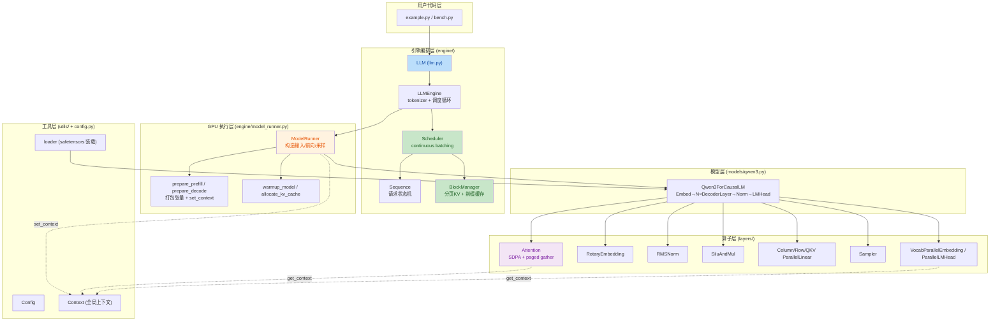
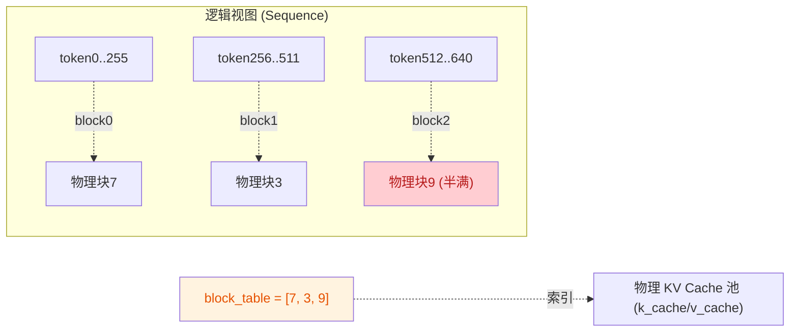
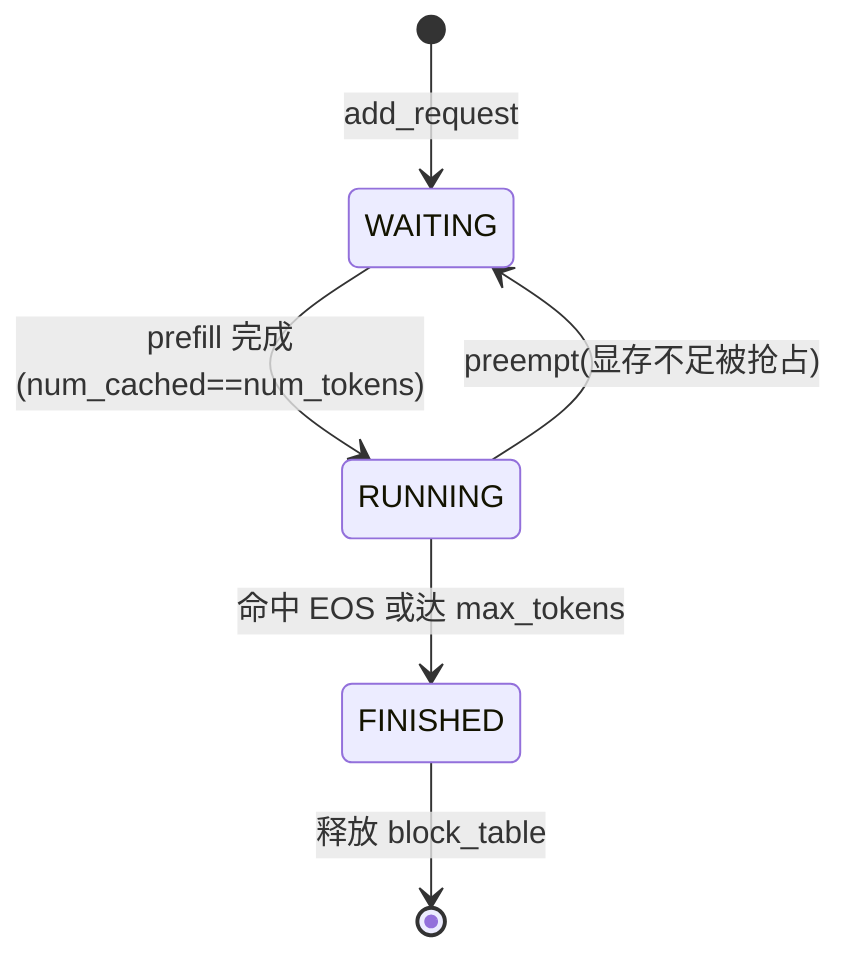
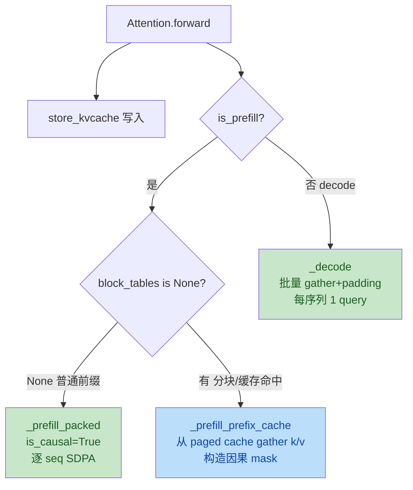
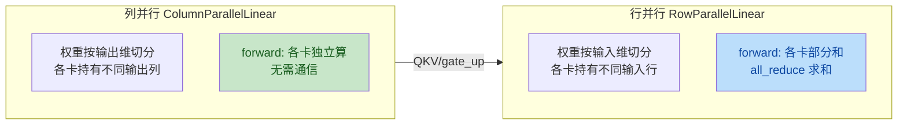
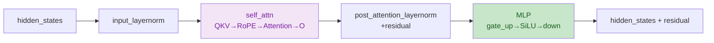
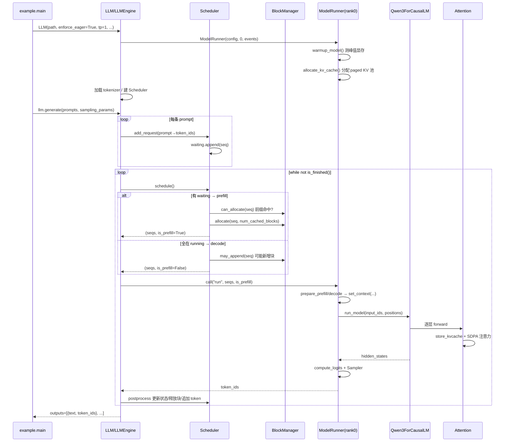

# nano-vllm 项目分析文档

> 一份从整体架构到模块细节、再到运行流程与用例的走读手册。
> 代码以仓库当前磁盘版本为准（已含 RTX 2060 / Windows 本地适配，见第六节）。

---

## 一、项目概览

**nano-vllm** 是 [vLLM](https://github.com/vllm-project/vllm) 的极简复刻，约 2000 行 Python，用最少的代码把生产级 LLM 推理引擎的核心技术讲清楚：

| 核心技术 | 作用 | 对应模块 |
|----------|------|----------|
| **PagedAttention（分页 KV Cache）** | 把 KV cache 按 block 分配，消除显存碎片、提升利用率 | `BlockManager` + `Attention` |
| **Prefix Caching** | 复用相同前缀（如 system prompt）已算过的 KV，省算力 | `BlockManager.hash_blocks` |
| **Continuous Batching** | 动态把新请求插入正在跑的 batch，不等整批结束 | `Scheduler` |
| **Chunked Prefill** | 超长 prompt 分块预填充，避免单步 OOM | `Scheduler.schedule` |
| **Tensor Parallel** | 多卡切分权重（列/行并行）做 TP | `layers/linear.py`、`embed_head.py` |

- **支持模型**：Qwen3（`models/qwen3.py`，含 GQA + QK-Norm）
- **入口**：`LLM(...).generate(prompts, sampling_params)`，与 vLLM API 风格一致

---

## 二、整体技术架构

### 2.1 分层架构图



### 2.2 功能模块一览

| 目录 | 文件 | 职责 |
|------|------|------|
| 根 | `llm.py` / `config.py` / `sampling_params.py` | LLM 入口、全局配置、采样参数 |
| `engine/` | `llm_engine.py` | 引擎主循环：收请求→调度→执行→输出 |
| | `scheduler.py` | 决定每步 prefill/decode 哪些 seq、多少 token |
| | `sequence.py` | 单条请求的状态（token 列表、block_table、进度） |
| | `block_manager.py` | 物理块分配/释放、前缀哈希命中 |
| | `model_runner.py` | GPU 侧：构造输入、前向、采样、KV cache 管理 |
| `models/` | `qwen3.py` | Qwen3 模型结构（DecoderLayer 堆叠） |
| `layers/` | `attention.py` | 注意力（含 paged KV 读写） |
| | `rotary_embedding.py` | RoPE 旋转位置编码 |
| | `layernorm.py` | RMSNorm（含残差融合） |
| | `activation.py` | SiLU 门控 |
| | `linear.py` | TP 并行线性层（列/行/QKV/merged） |
| | `embed_head.py` | 词嵌入 / LM Head（TP） |
| | `sampler.py` | Gumbel-max 采样 |
| `utils/` | `context.py` | 进程级全局上下文（is_prefill、cu_seqlens、slot_mapping…） |
| | `loader.py` | 从 safetensors 装载权重（处理 packed 模块） |

### 2.3 核心数据结构：分页 KV Cache

KV cache 不是按序列连续分配的，而是切成固定大小的 **block**（默认 256 token），按需从池子里取物理块，用 `block_table` 做逻辑→物理映射。这是 PagedAttention 的关键。



- `k_cache` 形状：`[num_blocks, block_size, num_kv_heads, head_dim]`
- `slot_mapping`：每个新 token 写入的扁平槽位 = `block_id * block_size + offset`
- 这套机制让显存按需分配、可回收、可跨序列共享（前缀缓存的基础）

---

## 三、模块详解

### 3.1 入口层：LLM / LLMEngine

`LLM` 只是 `LLMEngine` 的空壳（`class LLM(LLMEngine): pass`），真正逻辑在 `llm_engine.py`。

**构造**（`LLMEngine.__init__`）：读取配置 → 为 TP 多卡 fork 子进程（`ModelRunner` 跑在 rank>0）→ 主进程建 `ModelRunner(rank=0)` → 加载 tokenizer → 建 `Scheduler` → 注册 `atexit` 退出清理。

**核心方法 `generate`**（带中文注释）：

```python
def generate(self, prompts, sampling_params, use_tqdm=True) -> list[str]:
    # 输入: prompts=list[str]|list[list[int]], sampling_params 可单条或逐条
    # 输出: list[{"text":..., "token_ids":...}]，顺序与 prompts 一致
    pbar = tqdm(total=len(prompts), ...)
    if not isinstance(sampling_params, list):
        sampling_params = [sampling_params] * len(prompts)
    # 1) 把每条 prompt 编码为 token id 并交给调度器入队
    for prompt, sp in zip(prompts, sampling_params):
        self.add_request(prompt, sp)
    outputs = {}
    prefill_throughput = decode_throughput = 0.
    # 2) 引擎主循环：不停 step，直到所有序列完成
    while not self.is_finished():
        t = perf_counter()
        output, num_tokens = self.step()          # 推进一步（一次 prefill 或 decode）
        if num_tokens > 0:                         # prefill：num_tokens=本步预填充 token 数
            prefill_throughput = num_tokens / (perf_counter() - t)
        else:                                      # decode：num_tokens=-batch_size
            decode_throughput = -num_tokens / (perf_counter() - t)
        pbar.set_postfix({...})
        for seq_id, token_ids in output:           # 收集已完成的序列
            outputs[seq_id] = token_ids
            pbar.update(1)
    # 3) 按 seq_id 排序、解码成文本返回
    outputs = [outputs[seq_id] for seq_id in sorted(outputs.keys())]
    outputs = [{"text": self.tokenizer.decode(t), "token_ids": t} for t in outputs]
    return outputs
```

**`step`**（一步推进）：

```python
def step(self):
    # 输出: (已完成的 [(seq_id, token_ids)], num_tokens 用于统计)
    seqs, is_prefill = self.scheduler.schedule()            # 调度器决定本步跑谁
    num_tokens = sum(s.num_scheduled_tokens for s in seqs) if is_prefill else -len(seqs)
    token_ids = self.model_runner.call("run", seqs, is_prefill)  # GPU 前向+采样
    self.scheduler.postprocess(seqs, token_ids, is_prefill)      # 更新状态/释放块/追加 token
    outputs = [(s.seq_id, s.completion_token_ids) for s in seqs if s.is_finished]
    return outputs, num_tokens
```

> `model_runner.call("run", ...)`：当 `tp>1` 时，rank0 通过共享内存（`write_shm`）把方法名+参数广播给所有 worker，各 rank 各自执行同一 `run`，从而实现 TP 同步。

### 3.2 调度层

#### 3.2.1 Sequence —— 请求状态机



关键字段：`token_ids`（完整序列）、`num_prompt_tokens`、`num_cached_tokens`（已算过/已缓存的前缀长度）、`num_scheduled_tokens`（本步要算的）、`block_table`（逻辑→物理块映射）、`is_prefill`。

#### 3.2.2 Scheduler —— continuous batching

`schedule()` 每次返回 `(seqs, is_prefill)`，策略是**先 prefill 后 decode**：

```python
def schedule(self) -> tuple[list[Sequence], bool]:
    scheduled_seqs = []
    num_batched_tokens = 0
    # ===== prefill 阶段：尽量把等待中的序列塞进 batch =====
    while self.waiting and len(scheduled_seqs) < self.max_num_seqs:
        seq = self.waiting[0]
        remaining = self.max_num_batched_tokens - num_batched_tokens
        if remaining == 0: break
        if not seq.block_table:                  # 新序列：先看前缀缓存命中几个块
            num_cached_blocks = self.block_manager.can_allocate(seq)
            if num_cached_blocks == -1: break    # 显存不够，等
            num_tokens = seq.num_tokens - num_cached_blocks * self.block_size
        else:                                    # 已分配过（分块 prefill 的后续块）
            num_tokens = seq.num_tokens - seq.num_cached_tokens
        # 仅允许第一条序列分块（避免多序列同时分块造成死锁）
        if remaining < num_tokens and scheduled_seqs: break
        if not seq.block_table:
            self.block_manager.allocate(seq, num_cached_blocks)
        seq.num_scheduled_tokens = min(num_tokens, remaining)   # chunked prefill 关键
        num_batched_tokens += seq.num_scheduled_tokens
        if seq.num_cached_tokens + seq.num_scheduled_tokens == seq.num_tokens:
            seq.status = SequenceStatus.RUNNING
            self.waiting.popleft()
            self.running.append(seq)
        scheduled_seqs.append(seq)
    if scheduled_seqs: return scheduled_seqs, True
    # ===== decode 阶段：每条 running 序列各出 1 个 token =====
    while self.running and len(scheduled_seqs) < self.max_num_seqs:
        seq = self.running.popleft()
        while not self.block_manager.can_append(seq):   # 显存不足则抢占
            if self.running: self.preempt(self.running.pop())
            else: self.preempt(seq); break
        else:
            seq.num_scheduled_tokens = 1
            seq.is_prefill = False
            self.block_manager.may_append(seq)
            scheduled_seqs.append(seq)
    self.running.extendleft(reversed(scheduled_seqs))
    return scheduled_seqs, False
```

**chunked prefill**：当 `prompt 长度 > max_num_batched_tokens` 时，`num_scheduled_tokens` 被截到 `remaining`，剩余的留到下一步继续；此时 `num_cached_tokens>0`，下一步 prefill 会走「带前缀」路径。

**postprocess**（执行后更新）：

```python
def postprocess(self, seqs, token_ids, is_prefill):
    for seq, token_id in zip(seqs, token_ids):
        self.block_manager.hash_blocks(seq)        # 把新算好的 block 登记进前缀缓存
        seq.num_cached_tokens += seq.num_scheduled_tokens
        seq.num_scheduled_tokens = 0
        if is_prefill and seq.num_cached_tokens < seq.num_tokens:
            continue                                # 该序列还没 prefill 完，不采样新 token
        seq.append_token(token_id)
        if (not seq.ignore_eos and token_id == self.eos) or seq.num_completion_tokens == seq.max_tokens:
            seq.status = SequenceStatus.FINISHED
            self.block_manager.deallocate(seq)
            self.running.remove(seq)
```

#### 3.2.3 BlockManager —— 分页分配 + 前缀缓存

前缀缓存的核心：对每个完整 block 计算**链式哈希**（`hash(block_i) = xxh64(prefix_hash_i-1 || token_ids_i)`），存进 `hash_to_block_id`。新序列若前缀哈希命中且 token 完全匹配，就复用已有物理块（`ref_count` 引用计数），免去重算。

```python
def can_allocate(self, seq: Sequence) -> int:
    # 输出: 命中的前缀块数 num_cached_blocks；-1 表示显存不足
    h = -1
    num_cached_blocks = 0
    num_new_blocks = seq.num_blocks
    for i in range(seq.num_blocks - 1):            # 注意：最后一个不完整 block 不参与缓存
        token_ids = seq.block(i)
        h = self.compute_hash(token_ids, h)        # 链式哈希
        block_id = self.hash_to_block_id.get(h, -1)
        if block_id == -1 or self.blocks[block_id].token_ids != token_ids:
            break                                  # 哈希未命中或 token 不符
        num_cached_blocks += 1
        if block_id in self.used_block_ids:        # 已被别人用着→共享，无需新增
            num_new_blocks -= 1
    if len(self.free_block_ids) < num_new_blocks:
        return -1                                  # 剩余空闲块不够
    return num_cached_blocks
```

```python
def hash_blocks(self, seq: Sequence):
    # prefill 后调用：把本步新算的完整 block 计算哈希并登记，供后续序列复用
    start = seq.num_cached_tokens // self.block_size
    end = (seq.num_cached_tokens + seq.num_scheduled_tokens) // self.block_size
    if start == end: return
    h = self.blocks[seq.block_table[start - 1]].hash if start > 0 else -1
    for i in range(start, end):
        block = self.blocks[seq.block_table[i]]
        token_ids = seq.block(i)
        h = self.compute_hash(token_ids, h)
        block.update(h, token_ids)
        self.hash_to_block_id[h] = block.block_id
```

### 3.3 执行层：ModelRunner

负责把调度器选出的 `seqs` 变成 GPU 上的张量、跑前向、采样。

**`run`**（一次推理调用）：

```python
def run(self, seqs, is_prefill) -> list[int]:
    # 输入: seqs(调度器选出), is_prefill
    # 输出: 采样出的 token_id 列表（仅 rank0）
    input_ids, positions = self.prepare_prefill(seqs) if is_prefill else self.prepare_decode(seqs)
    temperatures = self.prepare_sample(seqs) if self.rank == 0 else None
    logits = self.run_model(input_ids, positions, is_prefill)
    token_ids = self.sampler(logits, temperatures).tolist() if self.rank == 0 else None
    reset_context()
    return token_ids
```

**`prepare_prefill`**（构造 prefill 输入 + 上下文）：

```python
def prepare_prefill(self, seqs):
    input_ids, positions, cu_seqlens_q, cu_seqlens_k, slot_mapping = [], [], [0], [0], [], []
    block_tables = None
    for seq in seqs:
        start = seq.num_cached_tokens            # 前缀已算过的长度
        seqlen_q = seq.num_scheduled_tokens      # 本步要算的新 token 数
        end = start + seqlen_q
        seqlen_k = end                            # k 长度 = 已缓存 + 本步新算
        input_ids.extend(seq[start:end])
        positions.extend(range(start, end))
        cu_seqlens_q.append(cu_seqlens_q[-1] + seqlen_q)
        cu_seqlens_k.append(cu_seqlens_k[-1] + seqlen_k)
        # 为本步覆盖到的 block 计算 slot_mapping（写到 k_cache 的哪个槽）
        if not seq.block_table: continue          # warmup 无 block_table
        ...  # 逐 block 填 slot_mapping
    if cu_seqlens_k[-1] > cu_seqlens_q[-1]:       # 有前缀缓存/分块 → 需要 block_tables 做 gather
        block_tables = self.prepare_block_tables(seqs)
    # 打包成 cuda 张量并写入全局 Context
    set_context(True, cu_seqlens_q, cu_seqlens_k, ..., slot_mapping, None, block_tables)
    return input_ids, positions
```

> `cu_seqlens_q`/`cu_seqlens_k` 是 vLLM 风格的「累积序列长度」，用于在拼接 batch 的张量里定位每条序列的边界。

**`warmup_model` + `allocate_kv_cache`**：先用最大规模（`min(max_num_batched_tokens, max_model_len)` × `num_seqs`）跑一次 prefill 测峰值显存，再据此把剩余显存全分给 KV cache 块池。

**`run_model`**（本地 `enforce_eager=True` 时只走 eager 前向）：

```python
def run_model(self, input_ids, positions, is_prefill):
    if is_prefill or self.enforce_eager or input_ids.size(0) > 512:
        return self.model.compute_logits(self.model(input_ids, positions))
    else:
        # CUDA graph 路径（本地已禁用，见第六节）
        ...
```

### 3.4 算子层

#### 3.4.1 Attention —— PagedAttention 核心

`Attention.forward` 是整个引擎最关键的算子：把新算的 K/V 写进分页 cache，再按 prefill/decode 两种模式做注意力。

```python
def forward(self, q, k, v):
    # q: [N,H,D], k/v: [N,Hkv,D]（N=本步 token 总数）
    context = get_context()
    k_cache, v_cache = self.k_cache, self.v_cache
    if k_cache.numel() and v_cache.numel():
        store_kvcache(k, v, k_cache, v_cache, context.slot_mapping)  # 写 KV cache
    if context.is_prefill:
        if context.block_tables is not None:   # 有前缀缓存/分块：k/v 要从 paged cache gather
            o = self._prefill_prefix_cache(q, k_cache, v_cache, context)
        else:                                   # 普通 packed prefill
            o = self._prefill_packed(q, k, v, context)
    else:                                       # decode：每序列 1 个 token
        o = self._decode(q, k_cache, v_cache, context)
    return o
```

**`store_kvcache`**（把新 K/V 写入分页 cache 的对应槽位）：

```python
def store_kvcache(key, value, k_cache, v_cache, slot_mapping):
    # key/value: [N, Hkv, D]; k_cache/v_cache: [num_blocks, block_size, Hkv, D]
    # slot_mapping: [N]，每个 token 的扁平槽位 block_id*block_size+offset；-1 表示跳过
    N, num_kv_heads, head_dim = key.shape
    D = num_kv_heads * head_dim
    k_flat = k_cache.reshape(-1, D)              # 展平成 [num_blocks*block_size, D]
    v_flat = v_cache.reshape(-1, D)
    valid = slot_mapping != -1                   # 过滤无效槽位（CUDA graph 占位用）
    slots = slot_mapping[valid].long()
    k_flat.index_copy_(0, slots, key.reshape(N, D)[valid])   # 原地按槽位写入
    v_flat.index_copy_(0, slots, value.reshape(N, D)[valid])
```

三条注意力路径（本地用 PyTorch SDPA 实现，原项目用 flash_attn/triton）：



`_prefill_prefix_cache` 的 mask 是正确性关键（见第六节修复）：

```python
def _prefill_prefix_cache(self, q, k_cache, v_cache, context):
    # q: [N,H,D]（新 token）; k/v 从 paged cache 按 block_table gather（含已缓存前缀）
    cu_q, cu_k = context.cu_seqlens_q, context.cu_seqlens_k
    block_tables = context.block_tables
    block_size = k_cache.shape[1]
    outs = []
    for i in range(cu_q.shape[0] - 1):
        qs, qe = int(cu_q[i]), int(cu_q[i+1])
        ks, ke = int(cu_k[i]), int(cu_k[i+1])
        Lq, Lk = qe - qs, ke - ks
        nb = (Lk + block_size - 1) // block_size
        phys = block_tables[i, :nb]                                  # 本 seq 用到的物理块
        k_seq = k_cache[phys].reshape(-1, self.num_kv_heads, self.head_dim)[:Lk]  # [Lk,Hkv,D]
        v_seq = v_cache[phys].reshape(-1, self.num_kv_heads, self.head_dim)[:Lk]
        qi = q[qs:qe].transpose(0,1).unsqueeze(0)                   # [1,H,Lq,D]
        ki = k_seq.transpose(0,1).unsqueeze(0)                       # [1,Hkv,Lk,D]
        vi = v_seq.transpose(0,1).unsqueeze(0)
        # query j 位于序列内绝对位置 (start+j), start=Lk-Lq(=num_cached_tokens)
        # 应 attend 到 k 列 [0, start+j]。k_seq 是 per-seq 局部坐标，故用 start，不是 cu_k 偏移
        rows = torch.arange(Lq, device=q.device) + (Lk - Lq)
        cols = torch.arange(Lk, device=q.device)
        mask = cols.unsqueeze(0) <= rows.unsqueeze(1)               # [Lq,Lk] 因果 mask
        oi = F.scaled_dot_product_attention(qi, ki, vi, attn_mask=mask.view(1,1,Lq,Lk),
                                            scale=self.scale, enable_gqa=True)
        outs.append(oi.squeeze(0).transpose(0,1))                   # [Lq,H,D]
    return torch.cat(outs, dim=0)
```

`_decode`（批量 decode：把每序列的 k/v gather 出来 padding 到等长，带 mask 一次算完）：

```python
def _decode(self, q, k_cache, v_cache, context):
    # q: [B,H,D] 每序列 1 个 token
    context_lens = context.context_lens                # [B] 每序列当前长度
    block_tables = context.block_tables
    block_size = k_cache.shape[1]
    B = q.shape[0]
    max_L = int(context_lens.max().item())             # padding 到最长序列
    max_nb = (max_L + block_size - 1) // block_size
    phys = block_tables[:, :max_nb]                    # [B, max_nb]
    k_pad = k_cache[phys].reshape(B, max_nb*block_size, self.num_kv_heads, self.head_dim)[:, :max_L]
    v_pad = v_cache[phys].reshape(B, max_nb*block_size, self.num_kv_heads, self.head_dim)[:, :max_L]
    qi = q.unsqueeze(2)                                # [B,H,1,D]
    ki = k_pad.transpose(1,2)                          # [B,Hkv,max_L,D]
    cols = torch.arange(max_L, device=q.device)
    mask = cols.unsqueeze(0) < context_lens.unsqueeze(1)   # [B,max_L] 屏蔽 padding
    o = F.scaled_dot_product_attention(qi, ki, vi, attn_mask=mask.view(B,1,1,max_L),
                                       scale=self.scale, enable_gqa=True)
    return o.squeeze(2)                                # [B,H,D]
```

#### 3.4.2 RotaryEmbedding —— RoPE

预计算 `cos_sin_cache`（`[max_pos, 1, head_dim]`，由 cos/sin 各 `[max_pos, head_dim/2]` 拼接而成），前向按 `positions` 取表做旋转：

```python
def forward(self, positions, query, key):
    # positions: [N]; query/key: [N, H, D]
    # 输出: 旋转后的 (query, key)
    cos_sin = self.cos_sin_cache[positions]            # [N,1,head_dim] = [N,1,rotary_dim]
    cos, sin = cos_sin.chunk(2, dim=-1)
    query = apply_rotary_emb(query, cos, sin)
    key = apply_rotary_emb(key, cos, sin)
    return query, key
```

#### 3.4.3 RMSNorm（残差融合）

`add_rms_forward` 把「残差相加 + RMSNorm」融合，省一次显存读写；`forward` 据 `residual` 是否为 None 分派。

#### 3.4.4 线性层 —— Tensor Parallel



`QKVParallelLinear` 把 Q/K/V 三个投影合并成一个大矩阵（packed），`MergedColumnParallelLinear` 把 gate/up 合并。`loader.py` 借助 `packed_modules_mapping` 把 safetensors 里的 `q_proj/k_proj/v_proj` 分别装进合并矩阵的对应分片。

`RowParallelLinear.forward` 末尾 `dist.all_reduce(y)` 做 TP 通信。

#### 3.4.5 Sampler —— Gumbel-max 采样

```python
def forward(self, logits, temperatures):
    # logits: [B, vocab]; temperatures: [B]
    # 输出: [B] 采样出的 token_id
    logits = logits.float().div_(temperatures.unsqueeze(1))          # 温度缩放
    probs = torch.softmax(logits, dim=-1)
    # Gumbel-max 等价于按概率采样：argmax(probs / Exp(1))
    sample_tokens = probs.div_(torch.empty_like(probs).exponential_(1).clamp_min_(1e-10)).argmax(dim=-1)
    return sample_tokens
```

> 注意：`temperature` 必须 > 1e-10（`SamplingParams` 断言），否则除零。所以本引擎**不支持 greedy(temperature=0)**，最低也要给一个小正数。

### 3.5 模型层：Qwen3

`Qwen3ForCausalLM` = `Qwen3Model`（Embed + N 层 `Qwen3DecoderLayer` + Norm）+ `ParallelLMHead`。每层：



`ParallelLMHead.forward` 在 prefill 时只取每条序列最后一个 token 的 hidden 算 logits（`cu_seqlens_q[1:]-1`），省算力。

### 3.6 工具层

- **`Config`**：dataclass，含模型路径、`max_num_batched_tokens`、`max_num_seqs`、`max_model_len`、`gpu_memory_utilization`、`tensor_parallel_size`、`enforce_eager`、`kvcache_block_size` 等。
- **`Context`**：进程级全局变量，`set_context` 写入、`get_context` 读取。让 `Attention`/`LMHead` 等算子无需改签名就能拿到 `is_prefill`、`cu_seqlens`、`slot_mapping`、`block_tables`、`context_lens`。
- **`loader.py`**：遍历 `*.safetensors`，按 `packed_modules_mapping` 把 HF 权重名映射到合并后的参数，调各 `weight_loader` 装载到对应分片。

---

## 四、example.py 运行核心流程

### 4.1 端到端时序图



### 4.2 逐步走读

1. **构造 `LLM`**：`ModelRunner` 在 GPU 上建模型、加载权重、warmup 测峰值、把剩余显存切成分页 KV 块池；`Attention` 模块拿到各自层的 `k_cache`/`v_cache` 切片。
2. **`generate`**：两条 prompt 经 `apply_chat_template` 包成对话格式后 `add_request` 入队。
3. **第一步（prefill）**：`schedule` 把两条序列都选进来，`prepare_prefill` 把 token 拼成 batch 张量、算 `cu_seqlens_q`/`cu_seqlens_k`/`slot_mapping`，`set_context`。前向时 `store_kvcache` 把 K/V 写进对应物理块，`_prefill_packed` 做 causal 注意力。`ParallelLMHead` 只取每条末位 token 算 logits，`Sampler` 采样。
4. **postprocess**：`hash_blocks` 登记前缀缓存，`num_cached_tokens` 推进，追加采样 token。
5. **后续步（decode）**：两条序列进 running，`schedule` 走 decode 分支，每条出 1 token，`prepare_decode` 准备 `context_lens`/`block_tables`，`_decode` 批量 gather + padding 注意力。
6. **完成**：任一序列命中 EOS 或达 `max_tokens` 即 `FINISHED` 并释放块；全部完成后按 `seq_id` 排序、解码返回。

---

## 五、覆盖主要功能的进阶用例

### 用例 1：多 prompt 批量生成（continuous batching）

```python
prompts = ["写一首春雨的诗", "解释量子纠缠", "翻译：Hello"]
llm.generate(prompts, SamplingParams(temperature=0.7, max_tokens=200))
```
三条请求同批 prefill、同批 decode，共享 GPU；先完成的先释放块，不影响其他。这就是 continuous batching 的日常用法。

### 用例 2：长 prompt 分块 prefill（chunked prefill）

```python
long_prompt = "..."   # 例如 4000 token，大于 max_num_batched_tokens
llm = LLM(path, enforce_eager=True, max_num_batched_tokens=512, max_model_len=8192)
llm.generate([long_prompt], SamplingParams(max_tokens=100))
```
- 第 1 步算 token[0:512]（普通 packed prefill），第 2 步算 token[512:1024]，此时 `num_cached_tokens=512>0` → 走 `_prefill_prefix_cache`，从 paged cache gather 已算前缀做带 mask 注意力。
- 这正是第三节修复的 mask 路径；已用 greedy A/B 对比验证：分块与不分块输出 token_ids 完全一致。

### 用例 3：Prefix Cache 命中

```python
sys_prompt = [{"role":"system","content":"你是一个严谨的数学助手，请逐步推理。"}] * 1
# 两条请求共享同一 system 前缀
p1 = tokenizer.apply_chat_template(sys_prompt + [{"role":"user","content":"算 17*23"}], tokenize=False, add_generation_prompt=True)
p2 = tokenizer.apply_chat_template(sys_prompt + [{"role":"user","content":"算 88+12"}], tokenize=False, add_generation_prompt=True)
llm.generate([p1, p2], SamplingParams(temperature=0.6))
```
- `p1` 先 prefill，其 system 前缀的完整 block 被哈希登记。
- `p2` 进来时 `can_allocate` 发现前缀哈希命中、token 匹配 → 复用 `p1` 已算的物理块（`ref_count++`），不再重算前缀 KV，省算力与显存。

### 用例 4：Tensor Parallel（多卡）

```python
# 需多 GPU 且装好 NCCL（Windows 无 NCCL 时本地回退 gloo）
llm = LLM(path, tensor_parallel_size=2, enforce_eager=True)
llm.generate(prompts, sampling_params)
```
- 构造时 fork 1 个 worker 子进程（rank1），两卡各持一半权重（列并行 QKV/gate_up，行并行 o_proj/down_proj）。
- 每步 `run`：rank0 经共享内存广播方法名+参数，两卡同算；`RowParallelLinear` 末尾 `all_reduce` 聚合；`ParallelLMHead` 用 `gather` 把两卡 logits 拼回 rank0 采样。
- ⚠️ 本地 Windows 环境无 NCCL，`backend` 回退 `gloo`，TP>1 仅功能可用但较慢。

### 用例 5：采样参数

```python
SamplingParams(temperature=0.6, max_tokens=256, ignore_eos=True)
# temperature>0 必须；ignore_eos=True 让序列不提前停（bench 用），跑到 max_tokens
```

---

## 六、本地适配说明（RTX 2060 / Windows）

当前磁盘版本相对原仓库的改动（均为环境兼容，不改算法语义）：

| 文件 | 改动 | 原因 |
|------|------|------|
| `example.py` | 模型路径指向本地；`enforce_eager=True`；`max_num_batched_tokens=2048, max_model_len=1024` | 本地模型路径；RTX 2060 无 CUDA graph；缩小 warmup |
| `layers/attention.py` | `flash_attn` → PyTorch `scaled_dot_product_attention`；triton `store_kvcache` → `index_copy_` | sm75 不支持 FA2；无 MSVC 无法 triton JIT |
| `layers/{rotary,layernorm,activation,sampler}.py` | 保留 `@torch.compile`（未改动） | sm75 上 inductor 不支持 bf16 编译，装饰器仅产生警告但不影响正确性；保留以维持原仓库代码一致 |
| `engine/model_runner.py` | `nccl`→不可用回退 `gloo`；`TCPStore(use_libuv=False)`；动态端口；`enforce_eager=False` 快速失败 | Windows 无 NCCL/libuv；避免端口冲突；SDPA 实现非 graph-safe |

**已修复的正确性/健壮性问题**：
1. `_prefill_prefix_cache` 的 mask 偏移由 `+ cu_k[i]`（跨 seq 累计）改为 `+ (Lk-Lq)`（per-seq `start`），修复分块 prefill / 前缀命中的错乱。
2. `enforce_eager=False` 在 `__init__` 开头抛 `NotImplementedError`，避免静默 NaN。
3. TCPStore 端口动态选取（tp=1），避免多实例/崩溃残留端口冲突。

**性能特征（RTX 2060, Qwen3-0.6B）**：Prefill ~280 tok/s，Decode ~17 tok/s。慢因 attention 走 SDPA math 后端（无融合内核）+ eager 模式；结果正确。

---

## 七、关键设计要点小结

1. **全局 Context 解耦**：调度信息（is_prefill、cu_seqlens、slot_mapping、block_tables…）经 `Context` 单例传给算子，避免在前向签名里层层透传，保持模型代码与 vLLM 风格一致。
2. **PagedAttention = 分页 + gather**：KV cache 按 block 分配，注意力时按 `block_table` gather 出所需 k/v，显存按需、可共享。
3. **前缀缓存靠链式哈希**：完整 block 的哈希串成链，命中即复用物理块，对长 system prompt / 多轮对话收益巨大。
4. **continuous batching 靠调度器**：每步动态重组 batch，prefill 优先、decode 次之，长 prompt 自动分块。
5. **TP 靠列/行并行 + 通信**：QKV/gate_up 列并行无通信，o_proj/down_proj 行并行 all_reduce；权重装载靠 `weight_loader` 切片。
6. **极简但有灵魂**：没有 vLLM 的复杂抽象层，2000 行把上述技术串成可运行引擎，非常适合学习。
